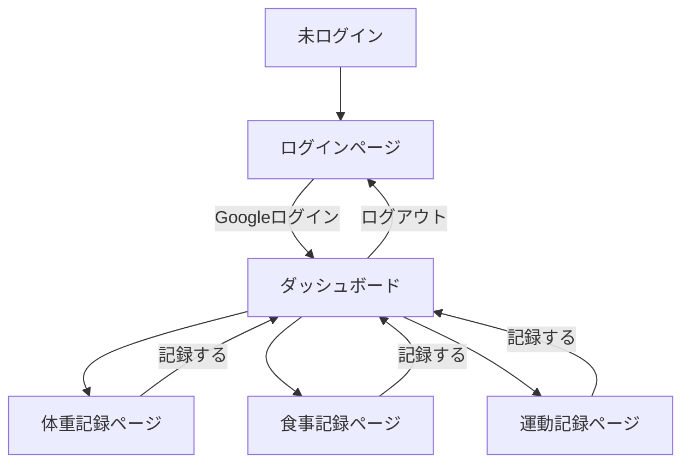
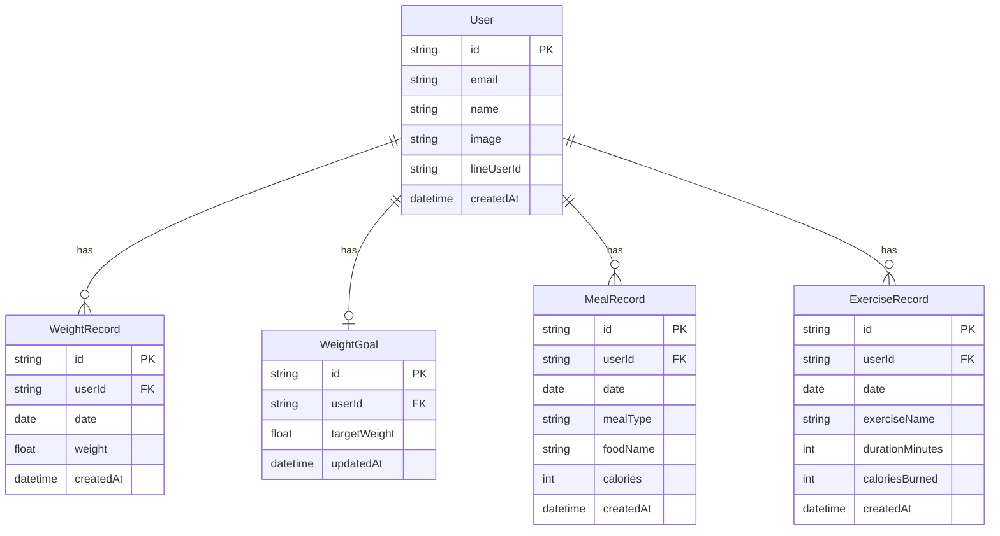

# 機能設計書

## 1. デザインシステム

### コンセプト

「クールでモダン、動きのあるグラデーション」

ブルー→パープル→ピンクのグラデーションを基調とし、洗練されたおしゃれな印象を与えるデザイン。
スマホ利用を中心に、視認性と操作性を保ちながらリッチなUIを実現する。

---

### カラーパレット

#### ブランドグラデーション

| 用途 | Tailwind クラス | カラーコード |
|---|---|---|
| メイングラデーション | `from-blue-500 via-purple-500 to-pink-500` | #3B82F6 → #A855F7 → #EC4899 |
| ライトグラデーション（背景） | `from-blue-50 via-purple-50 to-pink-50` | 薄めの同系統 |
| ダークグラデーション（ボタンhover） | `from-blue-600 via-purple-600 to-pink-600` | 濃いめの同系統 |

#### ベースカラー

| 用途 | Tailwind クラス | カラーコード |
|---|---|---|
| 背景（ページ全体） | `bg-gray-950` | #030712 |
| カード背景 | `bg-gray-900` | #111827 |
| カード境界線 | `border-gray-800` | #1F2937 |
| テキスト（メイン） | `text-white` | #FFFFFF |
| テキスト（サブ） | `text-gray-400` | #9CA3AF |
| テキスト（ラベル） | `text-gray-500` | #6B7280 |

#### セマンティックカラー

| 用途 | Tailwind クラス |
|---|---|
| 成功（カロリー黒字など） | `text-emerald-400` |
| 警告（カロリー超過など） | `text-amber-400` |
| エラー | `text-red-400` |

---

### タイポグラフィ

| 用途 | Tailwind クラス |
|---|---|
| ページタイトル | `text-2xl font-bold text-white` |
| セクション見出し | `text-lg font-semibold text-white` |
| 数値（体重・カロリー） | `text-4xl font-bold` ＋ グラデーションテキスト |
| 本文 | `text-sm text-gray-400` |
| ラベル | `text-xs text-gray-500 uppercase tracking-wide` |

**グラデーションテキスト（数値に使用）:**

```tsx
<span className="bg-gradient-to-r from-blue-400 via-purple-400 to-pink-400 bg-clip-text text-transparent">
  68.5
</span>
```

---

### コンポーネントスタイル

#### カード

```tsx
// ベースカード
<div className="rounded-2xl bg-gray-900 border border-gray-800 p-4 shadow-lg">

// グラデーションボーダーカード（強調したいカードに使用）
<div className="rounded-2xl p-[1px] bg-gradient-to-r from-blue-500 via-purple-500 to-pink-500">
  <div className="rounded-2xl bg-gray-900 p-4">
```

#### ボタン

```tsx
// プライマリボタン（グラデーション）
<button className="w-full rounded-xl bg-gradient-to-r from-blue-500 via-purple-500 to-pink-500
                   py-3 font-semibold text-white
                   hover:from-blue-600 hover:via-purple-600 hover:to-pink-600
                   transition-all duration-200 shadow-lg shadow-purple-500/25">

// セカンダリボタン（アウトライン）
<button className="w-full rounded-xl border border-gray-700 py-3 font-semibold text-gray-300
                   hover:border-purple-500 hover:text-white transition-all duration-200">
```

#### 入力フィールド

```tsx
<input className="w-full rounded-xl bg-gray-800 border border-gray-700 px-4 py-3 text-white
                  placeholder-gray-500
                  focus:border-purple-500 focus:ring-2 focus:ring-purple-500/20
                  outline-none transition-all duration-200">
```

#### ナビゲーションバー（ボトム）

```tsx
// アクティブアイコンはグラデーション、非アクティブはグレー
<nav className="fixed bottom-0 w-full bg-gray-900/80 backdrop-blur-md border-t border-gray-800">
```

---

### アニメーション・エフェクト

| 要素 | エフェクト |
|---|---|
| ページ遷移 | フェードイン（`animate-fade-in`） |
| カードホバー | 微妙な浮き上がり（`hover:-translate-y-0.5 transition-transform`） |
| ボタン押下 | スケールダウン（`active:scale-95`） |
| グラフ描画 | 右から左へスライドイン |
| 数値更新 | フェードで切り替え |

---

### 背景エフェクト

ページ全体の背景に薄いグラデーションのグロー（光彩）を入れてリッチ感を演出する。

```tsx
// layout.tsx に配置
<div className="fixed inset-0 -z-10 bg-gray-950">
  {/* 左上のグロー */}
  <div className="absolute top-0 left-1/4 w-96 h-96 bg-blue-500/10 rounded-full blur-3xl" />
  {/* 中央のグロー */}
  <div className="absolute top-1/3 left-1/2 w-96 h-96 bg-purple-500/10 rounded-full blur-3xl" />
  {/* 右下のグロー */}
  <div className="absolute bottom-0 right-1/4 w-96 h-96 bg-pink-500/10 rounded-full blur-3xl" />
</div>
```

---

### デザインイメージ（ダッシュボード）

```
┌──────────────────────────────────┐
│ ░░░░░░░░░░░░░░░░░░░░░░░░░░░░░░░░ │  ← 暗い背景（#030712）+グローエフェクト
│                                  │
│  Karada Log          [アイコン]   │  ← 白テキスト
│                                  │
│  2026年4月11日                    │  ← gray-400
│                                  │
│ ╔══════════════════════════════╗  │
│ ║  今日の体重           ⚖️     ║  │  ← グラデーションボーダーカード
│ ║                              ║  │
│ ║   [68.5] kg                  ║  │  ← グラデーションテキスト（大）
│ ║   目標まで -3.5 kg            ║  │  ← gray-400（小）
│ ╚══════════════════════════════╝  │
│                                  │
│ ┌──────────────────────────────┐  │
│ │  カロリー収支         🔥     │  │  ← 通常カード
│ │  摂取 1,800 / 消費 300 kcal  │  │
│ │  ██████████░░░░░░  +1,500    │  │  ← グラデーションプログレスバー
│ └──────────────────────────────┘  │
│                                  │
│ [═══体重を記録══] [══食事を記録══] │  ← グラデーションボタン
│ [══════════運動を記録═══════════] │
└──────────────────────────────────┘
```

---

## 2. システム構成図

```
┌─────────────────────────────────────────────────────────┐
│                        ユーザー                           │
└────────────┬────────────────────────┬────────────────────┘
             │ Webブラウザ             │ LINE
             ▼                        ▼
┌────────────────────┐   ┌────────────────────────────────┐
│   Next.js (Vercel) │   │      LINE Messaging API        │
│                    │   │      (Webhook)                 │
│  ┌──────────────┐  │   └───────────────┬────────────────┘
│  │   Pages /    │  │                   │
│  │   Components │  │                   │
│  └──────┬───────┘  │   ┌───────────────▼────────────────┐
│         │          │   │   Next.js API Routes           │
│  ┌──────▼───────┐  │◄──│   /api/line/webhook            │
│  │  API Routes  │  │   └────────────────────────────────┘
│  └──────┬───────┘  │
└─────────┼──────────┘
          │
    ┌─────┴──────┐
    │            │
    ▼            ▼
┌────────┐  ┌────────┐
│Supabase│  │Upstash │
│  (DB)  │  │(Redis) │
└────────┘  └────────┘
```

---

## 2. 画面遷移図



---

## 3. 画面一覧

| 画面名 | パス | 説明 |
|---|---|---|
| ログインページ | `/` | Googleログインボタンのみ表示 |
| ダッシュボード | `/dashboard` | 今日の記録サマリー・各記録へのナビゲーション |
| 体重記録ページ | `/weight` | 体重の入力・履歴グラフ・目標体重設定 |
| 食事記録ページ | `/meal` | 朝昼夜別の食事入力・1日の摂取カロリー合計 |
| 運動記録ページ | `/exercise` | 運動の入力・1日の消費カロリー合計 |

---

## 4. ワイヤーフレーム

### ダッシュボード（`/dashboard`）

```
┌──────────────────────────────┐
│  Karada Log     [ログアウト]  │
├──────────────────────────────┤
│  2026年4月11日（今日）         │
├──────────────────────────────┤
│  ⚖️ 体重                      │
│  68.5 kg  （目標: 65.0 kg）   │
├──────────────────────────────┤
│  🍽️ カロリー収支               │
│  摂取: 1,800 kcal             │
│  消費: 300 kcal               │
│  収支: +1,500 kcal            │
├──────────────────────────────┤
│  [体重を記録] [食事を記録]     │
│  [運動を記録]                  │
└──────────────────────────────┘
```

### 体重記録ページ（`/weight`）

```
┌──────────────────────────────┐
│  ← 体重記録                   │
├──────────────────────────────┤
│  今日の体重                   │
│  [ 68.5 ] kg  [保存]         │
├──────────────────────────────┤
│  目標体重: [ 65.0 ] kg [保存] │
├──────────────────────────────┤
│  推移グラフ（折れ線）          │
│  ~~~~~~~~~~~~~~~~~~~~~~      │
│  過去30日                     │
├──────────────────────────────┤
│  記録履歴                     │
│  4/11  68.5 kg  [削除]       │
│  4/10  68.8 kg  [削除]       │
│  4/9   69.0 kg  [削除]       │
└──────────────────────────────┘
```

### 食事記録ページ（`/meal`）

```
┌──────────────────────────────┐
│  ← 食事記録    2026/04/11    │
├──────────────────────────────┤
│  合計摂取カロリー: 1,800 kcal │
├──────────────────────────────┤
│  [朝食] [昼食] [夕食] [間食] │
├──────────────────────────────┤
│  ＋ 朝食を追加               │
│  食品名 [          ]         │
│  カロリー [ 　 ] kcal [保存] │
├──────────────────────────────┤
│  朝食  500 kcal              │
│  ・ご飯  250kcal  [削除]     │
│  ・目玉焼き 150kcal  [削除]  │
│  ・味噌汁  100kcal  [削除]   │
└──────────────────────────────┘
```

### 運動記録ページ（`/exercise`）

```
┌──────────────────────────────┐
│  ← 運動記録    2026/04/11    │
├──────────────────────────────┤
│  合計消費カロリー: 300 kcal   │
├──────────────────────────────┤
│  ＋ 運動を追加               │
│  種目   [          ]         │
│  時間   [ 　 ] 分            │
│  消費   [ 　 ] kcal  [保存]  │
├──────────────────────────────┤
│  記録一覧                     │
│  ウォーキング 30分 150kcal    │
│                      [削除]  │
│  ストレッチ  20分  50kcal    │
│                      [削除]  │
└──────────────────────────────┘
```

---

## 5. データモデル定義

### ER図



### テーブル定義

#### `users`

| カラム名 | 型 | 制約 | 説明 |
|---|---|---|---|
| id | TEXT | PK | NextAuth.jsが生成するID |
| email | TEXT | NOT NULL, UNIQUE | メールアドレス |
| name | TEXT | | 表示名 |
| image | TEXT | | プロフィール画像URL |
| line_user_id | TEXT | UNIQUE | LINEユーザーID（フェーズ2: LINE連携時に設定） |
| created_at | TIMESTAMPTZ | NOT NULL, DEFAULT now() | 作成日時 |

#### `weight_records`

| カラム名 | 型 | 制約 | 説明 |
|---|---|---|---|
| id | TEXT | PK | UUID |
| user_id | TEXT | FK → users.id | ユーザーID |
| date | DATE | NOT NULL | 記録日 |
| weight | NUMERIC(5,1) | NOT NULL | 体重（kg） |
| created_at | TIMESTAMPTZ | NOT NULL, DEFAULT now() | 作成日時 |

- ユニーク制約: `(user_id, date)`（1日1記録）

#### `weight_goals`

| カラム名 | 型 | 制約 | 説明 |
|---|---|---|---|
| id | TEXT | PK | UUID |
| user_id | TEXT | FK → users.id, UNIQUE | ユーザーID |
| target_weight | NUMERIC(5,1) | NOT NULL | 目標体重（kg） |
| updated_at | TIMESTAMPTZ | NOT NULL, DEFAULT now() | 更新日時 |

#### `meal_records`

| カラム名 | 型 | 制約 | 説明 |
|---|---|---|---|
| id | TEXT | PK | UUID |
| user_id | TEXT | FK → users.id | ユーザーID |
| date | DATE | NOT NULL | 記録日 |
| meal_type | TEXT | NOT NULL | 食事区分（breakfast / lunch / dinner / snack） |
| food_name | TEXT | NOT NULL | 食品名 |
| calories | INTEGER | NOT NULL | カロリー（kcal） |
| created_at | TIMESTAMPTZ | NOT NULL, DEFAULT now() | 作成日時 |

#### `exercise_records`

| カラム名 | 型 | 制約 | 説明 |
|---|---|---|---|
| id | TEXT | PK | UUID |
| user_id | TEXT | FK → users.id | ユーザーID |
| date | DATE | NOT NULL | 記録日 |
| exercise_name | TEXT | NOT NULL | 運動種目 |
| duration_minutes | INTEGER | NOT NULL | 運動時間（分） |
| calories_burned | INTEGER | NOT NULL | 消費カロリー（kcal） |
| created_at | TIMESTAMPTZ | NOT NULL, DEFAULT now() | 作成日時 |

---

## 6. API設計

### 共通仕様

#### 認証
全APIエンドポイント（`/api/auth` を除く）はセッションによる認証が必須。
未認証の場合は `401 Unauthorized` を返す。

#### エラーレスポンス形式
```json
{ "error": "エラーメッセージ" }
```

| ステータスコード | 意味 |
|---|---|
| 400 | リクエストの値が不正 |
| 401 | 未認証 |
| 403 | 他ユーザーのリソースへのアクセス |
| 404 | リソースが存在しない |
| 500 | サーバー内部エラー |

---

### 認証

| メソッド | パス | 説明 |
|---|---|---|
| GET/POST | `/api/auth/[...nextauth]` | NextAuth.jsのハンドラ（自動生成） |

---

### 体重

#### `GET /api/weight` — 体重記録一覧取得

リクエスト: なし

レスポンス `200`:
```json
[
  { "id": "uuid", "date": "2026-04-12", "weight": 68.5, "createdAt": "2026-04-12T00:00:00Z" },
  { "id": "uuid", "date": "2026-04-11", "weight": 68.8, "createdAt": "2026-04-11T00:00:00Z" }
]
```
※ 直近30件を日付降順で返す

---

#### `POST /api/weight` — 体重記録の登録（同日は上書き）

リクエスト:
```json
{ "date": "2026-04-12", "weight": 68.5 }
```

| フィールド | 型 | 必須 | バリデーション |
|---|---|---|---|
| date | string | ✅ | YYYY-MM-DD形式 |
| weight | number | ✅ | 20〜300の範囲、小数点1桁まで |

レスポンス `200`（上書き） / `201`（新規作成）:
```json
{ "id": "uuid", "date": "2026-04-12", "weight": 68.5, "createdAt": "2026-04-12T00:00:00Z" }
```

---

#### `DELETE /api/weight/[id]` — 体重記録の削除

リクエスト: なし

レスポンス `200`:
```json
{ "message": "削除しました" }
```

エラー `403`: 他ユーザーの記録を削除しようとした場合

---

#### `GET /api/weight/goal` — 目標体重の取得

リクエスト: なし

レスポンス `200`:
```json
{ "id": "uuid", "targetWeight": 65.0, "updatedAt": "2026-04-01T00:00:00Z" }
```

レスポンス `200`（未設定の場合）:
```json
{ "targetWeight": null }
```

---

#### `PUT /api/weight/goal` — 目標体重の登録・更新

リクエスト:
```json
{ "targetWeight": 65.0 }
```

| フィールド | 型 | 必須 | バリデーション |
|---|---|---|---|
| targetWeight | number | ✅ | 20〜300の範囲、小数点1桁まで |

レスポンス `200`:
```json
{ "id": "uuid", "targetWeight": 65.0, "updatedAt": "2026-04-12T00:00:00Z" }
```

---

### 食事

#### `GET /api/meal?date=YYYY-MM-DD` — 指定日の食事記録一覧取得

リクエスト: クエリパラメータ `date`（省略時は今日）

レスポンス `200`:
```json
[
  {
    "id": "uuid",
    "date": "2026-04-12",
    "mealType": "breakfast",
    "foodName": "ご飯",
    "calories": 250,
    "createdAt": "2026-04-12T07:30:00Z"
  }
]
```

---

#### `POST /api/meal` — 食事記録の登録

リクエスト:
```json
{ "date": "2026-04-12", "mealType": "breakfast", "foodName": "ご飯", "calories": 250 }
```

| フィールド | 型 | 必須 | バリデーション |
|---|---|---|---|
| date | string | ✅ | YYYY-MM-DD形式 |
| mealType | string | ✅ | `breakfast` / `lunch` / `dinner` / `snack` のいずれか |
| foodName | string | ✅ | 1〜50文字 |
| calories | number | ✅ | 0〜5000の整数 |

レスポンス `201`:
```json
{
  "id": "uuid",
  "date": "2026-04-12",
  "mealType": "breakfast",
  "foodName": "ご飯",
  "calories": 250,
  "createdAt": "2026-04-12T07:30:00Z"
}
```

---

#### `DELETE /api/meal/[id]` — 食事記録の削除

リクエスト: なし

レスポンス `200`:
```json
{ "message": "削除しました" }
```

エラー `403`: 他ユーザーの記録を削除しようとした場合

---

### 運動

#### `GET /api/exercise?date=YYYY-MM-DD` — 指定日の運動記録一覧取得

リクエスト: クエリパラメータ `date`（省略時は今日）

レスポンス `200`:
```json
[
  {
    "id": "uuid",
    "date": "2026-04-12",
    "exerciseName": "ウォーキング",
    "durationMinutes": 30,
    "caloriesBurned": 150,
    "createdAt": "2026-04-12T08:00:00Z"
  }
]
```

---

#### `POST /api/exercise` — 運動記録の登録

リクエスト:
```json
{ "date": "2026-04-12", "exerciseName": "ウォーキング", "durationMinutes": 30, "caloriesBurned": 150 }
```

| フィールド | 型 | 必須 | バリデーション |
|---|---|---|---|
| date | string | ✅ | YYYY-MM-DD形式 |
| exerciseName | string | ✅ | 1〜50文字 |
| durationMinutes | number | ✅ | 1〜600の整数 |
| caloriesBurned | number | ✅ | 0〜5000の整数 |

レスポンス `201`:
```json
{
  "id": "uuid",
  "date": "2026-04-12",
  "exerciseName": "ウォーキング",
  "durationMinutes": 30,
  "caloriesBurned": 150,
  "createdAt": "2026-04-12T08:00:00Z"
}
```

---

#### `DELETE /api/exercise/[id]` — 運動記録の削除

リクエスト: なし

レスポンス `200`:
```json
{ "message": "削除しました" }
```

エラー `403`: 他ユーザーの記録を削除しようとした場合

---

### LINE Webhook

#### `POST /api/line/webhook` — LINEメッセージ受信

リクエスト: LINE Messaging APIが送信するWebhookペイロード（署名検証あり）

レスポンス `200`: 常に200を返す（LINEプラットフォームの仕様）

※ 詳細はセクション8「LINE連携仕様」を参照

---

## 7. コンポーネント設計

```
src/
├── app/
│   ├── page.tsx                  # ログインページ
│   ├── dashboard/
│   │   └── page.tsx              # ダッシュボード
│   ├── weight/
│   │   └── page.tsx              # 体重記録ページ
│   ├── meal/
│   │   └── page.tsx              # 食事記録ページ
│   └── exercise/
│       └── page.tsx              # 運動記録ページ
│
├── components/
│   ├── layout/
│   │   ├── Header.tsx            # ヘッダー（ログアウトボタン含む）
│   │   └── BottomNav.tsx         # ボトムナビゲーション（スマホ用）
│   ├── weight/
│   │   ├── WeightForm.tsx        # 体重入力フォーム
│   │   ├── WeightChart.tsx       # 体重推移グラフ（Recharts の LineChart を使用）
│   │   ├── WeightHistory.tsx     # 体重記録履歴リスト
│   │   └── WeightGoalForm.tsx    # 目標体重設定フォーム
│   ├── meal/
│   │   ├── MealTabBar.tsx        # 朝昼夜間食タブ
│   │   ├── MealForm.tsx          # 食事入力フォーム
│   │   └── MealList.tsx          # 食事記録リスト
│   ├── exercise/
│   │   ├── ExerciseForm.tsx      # 運動入力フォーム
│   │   └── ExerciseList.tsx      # 運動記録リスト
│   └── dashboard/
│       ├── WeightSummary.tsx     # 今日の体重サマリー
│       └── CalorieSummary.tsx    # カロリー収支サマリー
│
└── lib/
    ├── auth.ts                   # NextAuth.js設定
    ├── db.ts                     # Supabaseクライアント
    ├── redis.ts                  # Upstashクライアント
    └── line.ts                   # LINE SDK設定
```

---

## 8. LINE連携仕様

### メッセージ解析ルール

LINEから送信されたテキストを以下のルールで解析し、食事・運動として記録する。

#### 食事の記録

```
書式: [食事区分] [食品名] [カロリー]kcal

例:
  朝 ご飯 250kcal
  昼 ラーメン 500kcal
  夜 サラダ 150kcal
  間食 チョコ 100kcal
```

#### 運動の記録

```
書式: 運動 [種目] [時間]分 [消費カロリー]kcal

例:
  運動 ウォーキング 30分 150kcal
  運動 ランニング 20分 200kcal
```

### 処理フロー

```
LINEユーザーがメッセージ送信
        ↓
Webhook（/api/line/webhook）がメッセージ受信
        ↓
署名検証（LINE_CHANNEL_SECRETで正当性確認）
        ↓
テキスト解析（食事 or 運動を判定）
        ↓
データベースに記録
        ↓
LINEへ完了メッセージを返信
（例: 「朝食にご飯(250kcal)を記録しました」）
```

### LINEアカウントとアプリユーザーの紐付け

- 初回メッセージ受信時にLINEユーザーIDとアプリのユーザーIDを紐付ける
- 紐付けはRedis（Upstash）にキャッシュして高速化する
