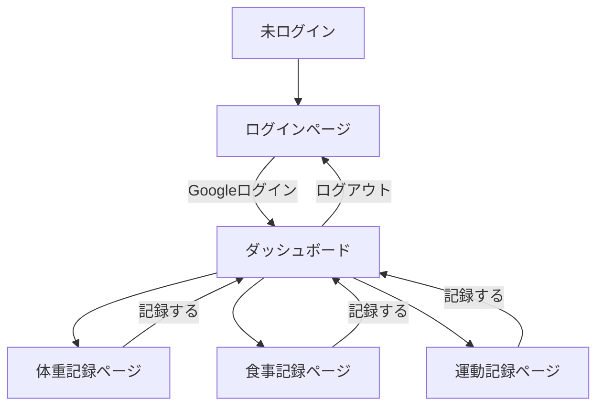
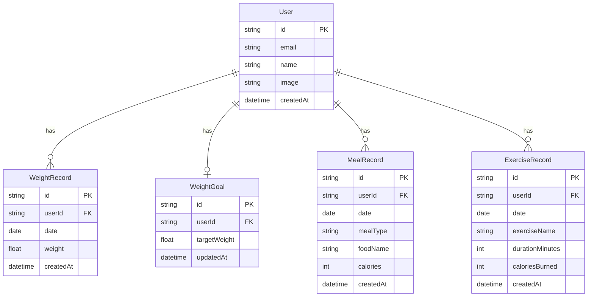

# 機能設計書

## 1. システム構成図

```
┌─────────────────────────────────────────────────────────┐
│                        ユーザー                           │
└────────────┬────────────────────────┬────────────────────┘
             │ Webブラウザ             │ LINE
             ▼                        ▼
┌────────────────────┐   ┌────────────────────────────────┐
│   Next.js (Vercel) │   │      LINE Messaging API        │
│                    │   │      (Webhook)                 │
│  ┌──────────────┐  │   └───────────────┬────────────────┘
│  │   Pages /    │  │                   │
│  │   Components │  │                   │
│  └──────┬───────┘  │   ┌───────────────▼────────────────┐
│         │          │   │   Next.js API Routes           │
│  ┌──────▼───────┐  │◄──│   /api/line/webhook            │
│  │  API Routes  │  │   └────────────────────────────────┘
│  └──────┬───────┘  │
└─────────┼──────────┘
          │
    ┌─────┴──────┐
    │            │
    ▼            ▼
┌────────┐  ┌────────┐
│Supabase│  │Upstash │
│  (DB)  │  │(Redis) │
└────────┘  └────────┘
```

---

## 2. 画面遷移図



---

## 3. 画面一覧

| 画面名 | パス | 説明 |
|---|---|---|
| ログインページ | `/` | Googleログインボタンのみ表示 |
| ダッシュボード | `/dashboard` | 今日の記録サマリー・各記録へのナビゲーション |
| 体重記録ページ | `/weight` | 体重の入力・履歴グラフ・目標体重設定 |
| 食事記録ページ | `/meal` | 朝昼夜別の食事入力・1日の摂取カロリー合計 |
| 運動記録ページ | `/exercise` | 運動の入力・1日の消費カロリー合計 |

---

## 4. ワイヤーフレーム

### ダッシュボード（`/dashboard`）

```
┌──────────────────────────────┐
│  Karada Log     [ログアウト]  │
├──────────────────────────────┤
│  2026年4月11日（今日）         │
├──────────────────────────────┤
│  ⚖️ 体重                      │
│  68.5 kg  （目標: 65.0 kg）   │
├──────────────────────────────┤
│  🍽️ カロリー収支               │
│  摂取: 1,800 kcal             │
│  消費: 300 kcal               │
│  収支: +1,500 kcal            │
├──────────────────────────────┤
│  [体重を記録] [食事を記録]     │
│  [運動を記録]                  │
└──────────────────────────────┘
```

### 体重記録ページ（`/weight`）

```
┌──────────────────────────────┐
│  ← 体重記録                   │
├──────────────────────────────┤
│  今日の体重                   │
│  [ 68.5 ] kg  [保存]         │
├──────────────────────────────┤
│  目標体重: [ 65.0 ] kg [保存] │
├──────────────────────────────┤
│  推移グラフ（折れ線）          │
│  ~~~~~~~~~~~~~~~~~~~~~~      │
│  過去30日                     │
├──────────────────────────────┤
│  記録履歴                     │
│  4/11  68.5 kg  [削除]       │
│  4/10  68.8 kg  [削除]       │
│  4/9   69.0 kg  [削除]       │
└──────────────────────────────┘
```

### 食事記録ページ（`/meal`）

```
┌──────────────────────────────┐
│  ← 食事記録    2026/04/11    │
├──────────────────────────────┤
│  合計摂取カロリー: 1,800 kcal │
├──────────────────────────────┤
│  [朝食] [昼食] [夕食] [間食] │
├──────────────────────────────┤
│  ＋ 朝食を追加               │
│  食品名 [          ]         │
│  カロリー [ 　 ] kcal [保存] │
├──────────────────────────────┤
│  朝食  500 kcal              │
│  ・ご飯  250kcal  [削除]     │
│  ・目玉焼き 150kcal  [削除]  │
│  ・味噌汁  100kcal  [削除]   │
└──────────────────────────────┘
```

### 運動記録ページ（`/exercise`）

```
┌──────────────────────────────┐
│  ← 運動記録    2026/04/11    │
├──────────────────────────────┤
│  合計消費カロリー: 300 kcal   │
├──────────────────────────────┤
│  ＋ 運動を追加               │
│  種目   [          ]         │
│  時間   [ 　 ] 分            │
│  消費   [ 　 ] kcal  [保存]  │
├──────────────────────────────┤
│  記録一覧                     │
│  ウォーキング 30分 150kcal    │
│                      [削除]  │
│  ストレッチ  20分  50kcal    │
│                      [削除]  │
└──────────────────────────────┘
```

---

## 5. データモデル定義

### ER図



### テーブル定義

#### `users`

| カラム名 | 型 | 制約 | 説明 |
|---|---|---|---|
| id | TEXT | PK | NextAuth.jsが生成するID |
| email | TEXT | NOT NULL, UNIQUE | メールアドレス |
| name | TEXT | | 表示名 |
| image | TEXT | | プロフィール画像URL |
| created_at | TIMESTAMPTZ | NOT NULL, DEFAULT now() | 作成日時 |

#### `weight_records`

| カラム名 | 型 | 制約 | 説明 |
|---|---|---|---|
| id | TEXT | PK | UUID |
| user_id | TEXT | FK → users.id | ユーザーID |
| date | DATE | NOT NULL | 記録日 |
| weight | NUMERIC(5,1) | NOT NULL | 体重（kg） |
| created_at | TIMESTAMPTZ | NOT NULL, DEFAULT now() | 作成日時 |

- ユニーク制約: `(user_id, date)`（1日1記録）

#### `weight_goals`

| カラム名 | 型 | 制約 | 説明 |
|---|---|---|---|
| id | TEXT | PK | UUID |
| user_id | TEXT | FK → users.id, UNIQUE | ユーザーID |
| target_weight | NUMERIC(5,1) | NOT NULL | 目標体重（kg） |
| updated_at | TIMESTAMPTZ | NOT NULL, DEFAULT now() | 更新日時 |

#### `meal_records`

| カラム名 | 型 | 制約 | 説明 |
|---|---|---|---|
| id | TEXT | PK | UUID |
| user_id | TEXT | FK → users.id | ユーザーID |
| date | DATE | NOT NULL | 記録日 |
| meal_type | TEXT | NOT NULL | 食事区分（breakfast / lunch / dinner / snack） |
| food_name | TEXT | NOT NULL | 食品名 |
| calories | INTEGER | NOT NULL | カロリー（kcal） |
| created_at | TIMESTAMPTZ | NOT NULL, DEFAULT now() | 作成日時 |

#### `exercise_records`

| カラム名 | 型 | 制約 | 説明 |
|---|---|---|---|
| id | TEXT | PK | UUID |
| user_id | TEXT | FK → users.id | ユーザーID |
| date | DATE | NOT NULL | 記録日 |
| exercise_name | TEXT | NOT NULL | 運動種目 |
| duration_minutes | INTEGER | NOT NULL | 運動時間（分） |
| calories_burned | INTEGER | NOT NULL | 消費カロリー（kcal） |
| created_at | TIMESTAMPTZ | NOT NULL, DEFAULT now() | 作成日時 |

---

## 6. API設計

### 認証

| メソッド | パス | 説明 |
|---|---|---|
| GET | `/api/auth/[...nextauth]` | NextAuth.jsのハンドラ |

### 体重

| メソッド | パス | 説明 |
|---|---|---|
| GET | `/api/weight` | 体重記録一覧取得（直近30件） |
| POST | `/api/weight` | 体重記録の登録・更新（同日は上書き） |
| DELETE | `/api/weight/[id]` | 体重記録の削除 |
| GET | `/api/weight/goal` | 目標体重の取得 |
| PUT | `/api/weight/goal` | 目標体重の登録・更新 |

### 食事

| メソッド | パス | 説明 |
|---|---|---|
| GET | `/api/meal?date=YYYY-MM-DD` | 指定日の食事記録一覧取得 |
| POST | `/api/meal` | 食事記録の登録 |
| DELETE | `/api/meal/[id]` | 食事記録の削除 |

### 運動

| メソッド | パス | 説明 |
|---|---|---|
| GET | `/api/exercise?date=YYYY-MM-DD` | 指定日の運動記録一覧取得 |
| POST | `/api/exercise` | 運動記録の登録 |
| DELETE | `/api/exercise/[id]` | 運動記録の削除 |

### LINE Webhook

| メソッド | パス | 説明 |
|---|---|---|
| POST | `/api/line/webhook` | LINEからのメッセージ受信・記録処理 |

---

## 7. コンポーネント設計

```
src/
├── app/
│   ├── page.tsx                  # ログインページ
│   ├── dashboard/
│   │   └── page.tsx              # ダッシュボード
│   ├── weight/
│   │   └── page.tsx              # 体重記録ページ
│   ├── meal/
│   │   └── page.tsx              # 食事記録ページ
│   └── exercise/
│       └── page.tsx              # 運動記録ページ
│
├── components/
│   ├── layout/
│   │   ├── Header.tsx            # ヘッダー（ログアウトボタン含む）
│   │   └── BottomNav.tsx         # ボトムナビゲーション（スマホ用）
│   ├── weight/
│   │   ├── WeightForm.tsx        # 体重入力フォーム
│   │   ├── WeightChart.tsx       # 体重推移グラフ
│   │   ├── WeightHistory.tsx     # 体重記録履歴リスト
│   │   └── WeightGoalForm.tsx    # 目標体重設定フォーム
│   ├── meal/
│   │   ├── MealTabBar.tsx        # 朝昼夜間食タブ
│   │   ├── MealForm.tsx          # 食事入力フォーム
│   │   └── MealList.tsx          # 食事記録リスト
│   ├── exercise/
│   │   ├── ExerciseForm.tsx      # 運動入力フォーム
│   │   └── ExerciseList.tsx      # 運動記録リスト
│   └── dashboard/
│       ├── WeightSummary.tsx     # 今日の体重サマリー
│       └── CalorieSummary.tsx    # カロリー収支サマリー
│
└── lib/
    ├── auth.ts                   # NextAuth.js設定
    ├── db.ts                     # Supabaseクライアント
    ├── redis.ts                  # Upstashクライアント
    └── line.ts                   # LINE SDK設定
```

---

## 8. LINE連携仕様

### メッセージ解析ルール

LINEから送信されたテキストを以下のルールで解析し、食事・運動として記録する。

#### 食事の記録

```
書式: [食事区分] [食品名] [カロリー]kcal

例:
  朝 ご飯 250kcal
  昼 ラーメン 500kcal
  夜 サラダ 150kcal
  間食 チョコ 100kcal
```

#### 運動の記録

```
書式: 運動 [種目] [時間]分 [消費カロリー]kcal

例:
  運動 ウォーキング 30分 150kcal
  運動 ランニング 20分 200kcal
```

### 処理フロー

```
LINEユーザーがメッセージ送信
        ↓
Webhook（/api/line/webhook）がメッセージ受信
        ↓
署名検証（LINE_CHANNEL_SECRETで正当性確認）
        ↓
テキスト解析（食事 or 運動を判定）
        ↓
データベースに記録
        ↓
LINEへ完了メッセージを返信
（例: 「朝食にご飯(250kcal)を記録しました」）
```

### LINEアカウントとアプリユーザーの紐付け

- 初回メッセージ受信時にLINEユーザーIDとアプリのユーザーIDを紐付ける
- 紐付けはRedis（Upstash）にキャッシュして高速化する
